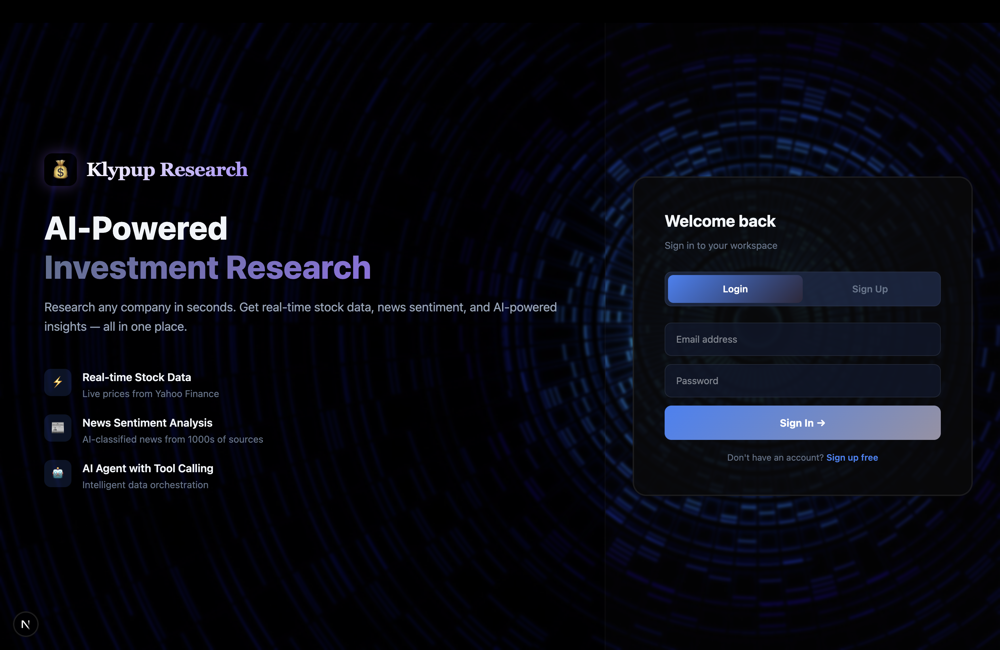
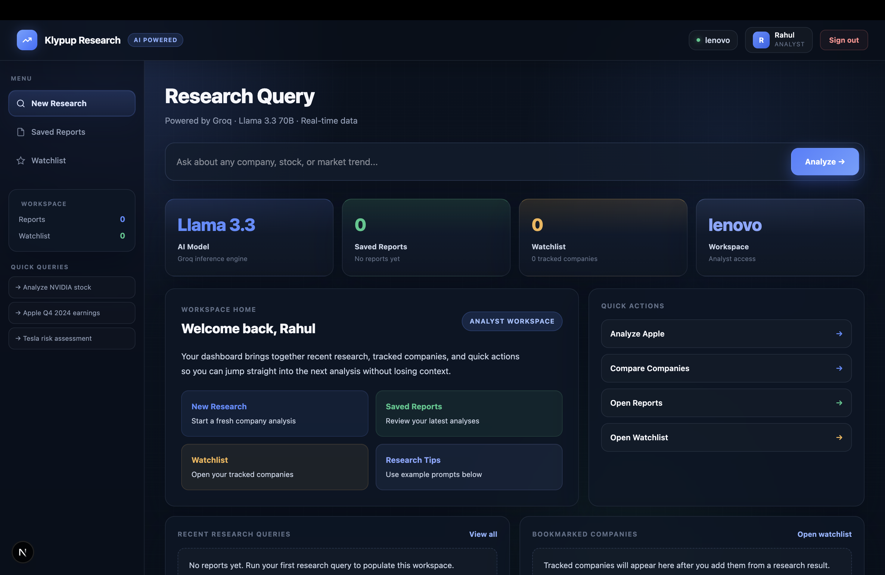
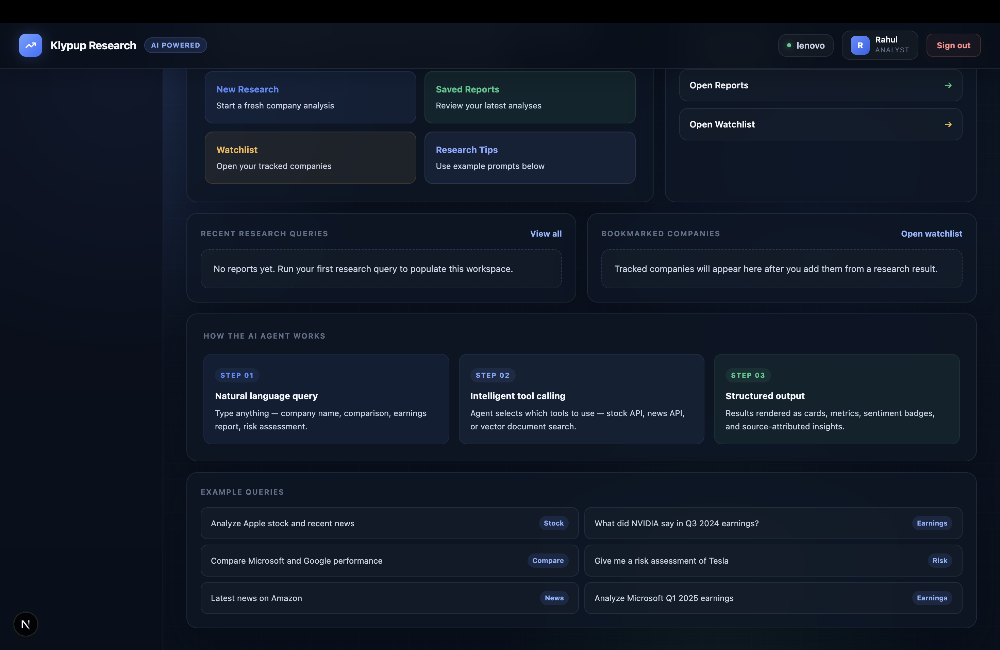
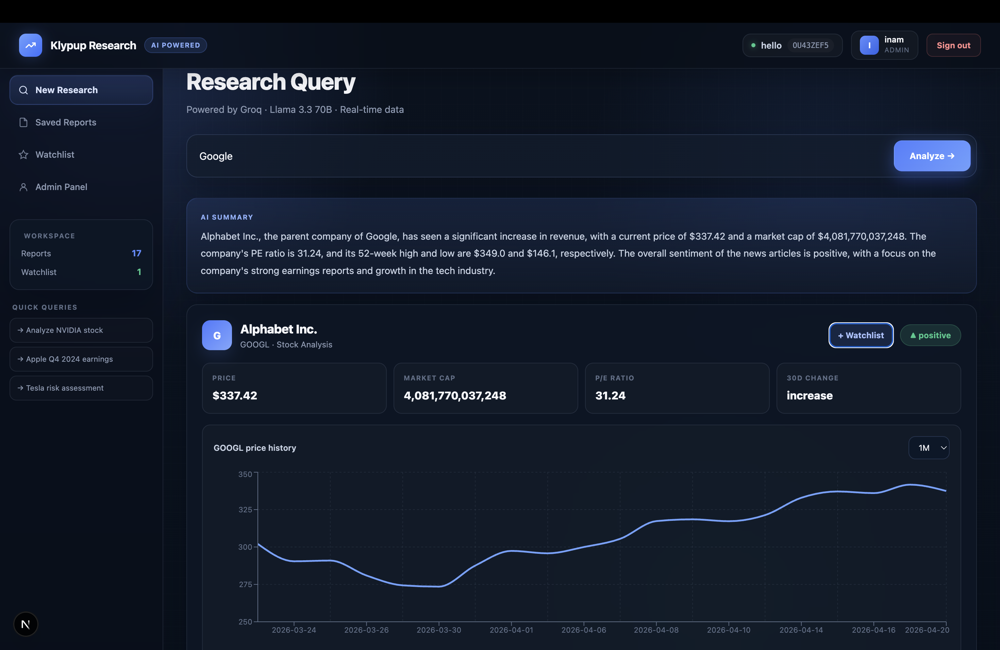
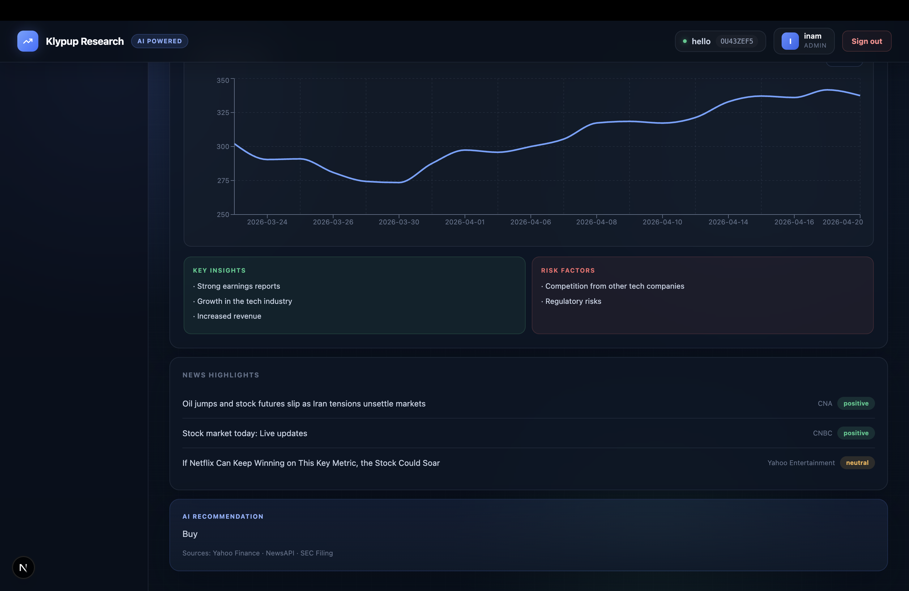
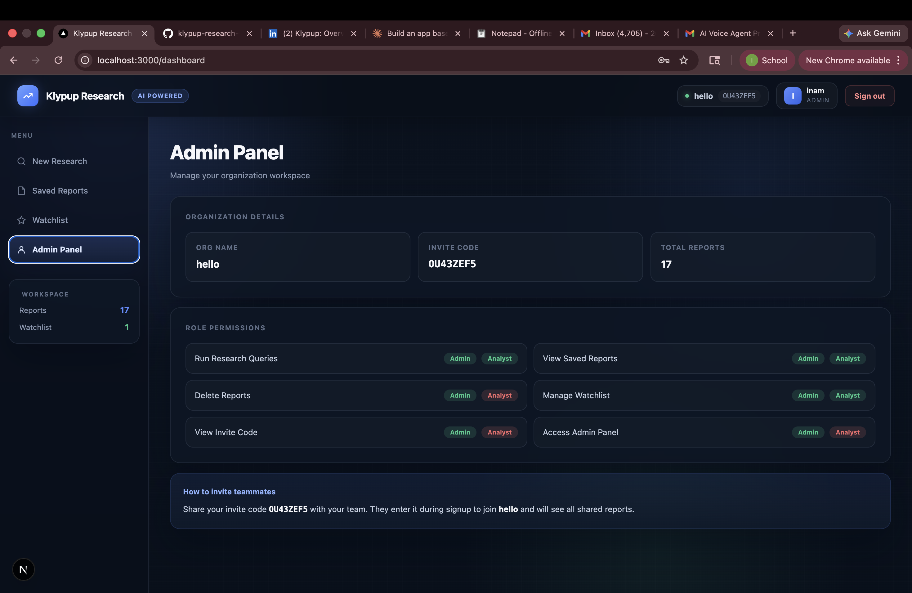

# Klypup Research Dashboard

An AI-powered investment research platform that lets analysts research any company in seconds. Built for the Klypup Applied AI Intern Assessment — Option A.

## Screenshots








## What it does

Type any research query like *"Analyze NVIDIA's stock and recent news"* and the AI agent automatically:
- Fetches real-time stock data from Yahoo Finance
- Gets latest news articles with sentiment analysis
- Searches through earnings reports and SEC filings using RAG
- Synthesizes everything into a structured analysis with insights, risks, and recommendations
- Renders results as cards, charts, sentiment badges, not raw text

## Tech Stack

| Layer | Technology | Why |
|-------|-----------|-----|
| Backend | FastAPI (Python) | Fast, async, great for AI workloads. Prior experience. |
| Database | SQLite | Zero setup, file-based, perfect for 5-day timeline |
| Frontend | Next.js + React | Modern, fast, great developer experience |
| AI/LLM | Groq (Llama 3.3 70B) | Free, extremely fast inference, supports tool calling |
| Vector DB | ChromaDB | Local RAG, no external service needed |
| Stock Data | Yahoo Finance (yfinance) | Free, no API key required |
| News | NewsAPI | Free tier, well documented |
| Charts | Recharts | Clean React charting library |

## Features

-  JWT Authentication (signup, login, logout, protected routes)
-  Multi-tenant architecture (org isolation via org_id on every query)
-  Role-based access control (Admin vs Analyst — different UI and permissions)
-  AI agent with 3 tools (stock data, news, document search)
-  Intelligent tool calling (agent decides which tools to use per query)
-  Real-time stock data (price, market cap, P/E ratio, EPS)
-  Interactive stock price charts (5D, 1M, 3M, 6M, 1Y periods)
-  News sentiment analysis (positive/negative/neutral classification)
-  RAG document search (ChromaDB vector store with earnings reports)
-  Saved research reports (full CRUD)
-  Company watchlist (add from results, remove anytime)
-  Organization invite code system
-  Source attribution on every AI insight
-  Admin panel with role permissions overview
-  Structured UI output (cards, badges, metrics, charts)

## Setup Instructions

### Prerequisites
- Python 3.10+
- Node.js 18+
- Groq API key — free at [console.groq.com](https://console.groq.com)
- NewsAPI key — free at [newsapi.org](https://newsapi.org)

### Backend Setup

```bash
cd backend
python3 -m venv venv
source venv/bin/activate
pip install -r requirements.txt
```

Create `.env` file (see `.env.example`in the backend folder):
- GROQ_API_KEY=your_groq_key_here
- NEWS_API_KEY=your_newsapi_key_here
- SECRET_KEY=your-secret-key-here
- DATABASE_URL=sqlite:///./research.db

Ingest sample financial documents into ChromaDB:
```bash
python data/sample_docs.py
```

Start the backend:
```bash
uvicorn app.main:app --reload
```

Backend runs at **http://127.0.0.1:8000**
API docs at **http://127.0.0.1:8000/docs**

### Frontend Setup

```bash
cd frontend
npm install
npm run dev
```

Frontend runs at **http://localhost:3000**

## Demo Workflows

### 1. AI Research Query
- Sign up and create an organization
- Type any company query: *"Analyze Apple stock"*
- Watch the AI agent fetch real data and return structured analysis
- View interactive stock price chart with period selector
- Add company to watchlist directly from results

### 2. Multi-Tenant Isolation
- Create two accounts with different organization names
- Run queries in each, reports are completely separate
- Share invite code with teammates to join same workspace
- Admins can see invite code, analysts cannot

### 3. Role-Based Access
- Login as **Admin** — see Admin Panel, delete reports, view invite code
- Login as **Analyst** — no Admin Panel, no delete button, no invite code

## API Endpoints

| Method | Endpoint | Auth | Description |
|--------|----------|------|-------------|
| POST | /api/auth/signup | No | Create account + org |
| POST | /api/auth/login | No | Login, get JWT token |
| POST | /api/research/query | Yes | Run AI research query |
| GET | /api/research/reports | Yes | Get all saved reports |
| GET | /api/research/reports/{id} | Yes | Get single report |
| DELETE | /api/research/reports/{id} | Yes | Delete a report |
| GET | /api/research/stock-chart | Yes | Get stock price history |
| GET | /api/watchlist/ | Yes | Get watchlist |
| POST | /api/watchlist/ | Yes | Add to watchlist |
| DELETE | /api/watchlist/{id} | Yes | Remove from watchlist |

## Known Limitations

- SQLite used instead of PostgreSQL — fine for demo, not for production
- Sentiment analysis is keyword-based, not ML-based
- No real-time streaming of AI responses
- Sample financial documents are synthetic, not real SEC filings
- NewsAPI free tier limited to 100 requests/day
- Groq free tier limited to 100,000 tokens/day

## Author

**Innam Ul Haq**
innamhaq7@gmail.com | [LinkedIn](https://linkedin.com/in/innamhaq) | [GitHub](https://github.com/hakinam)
