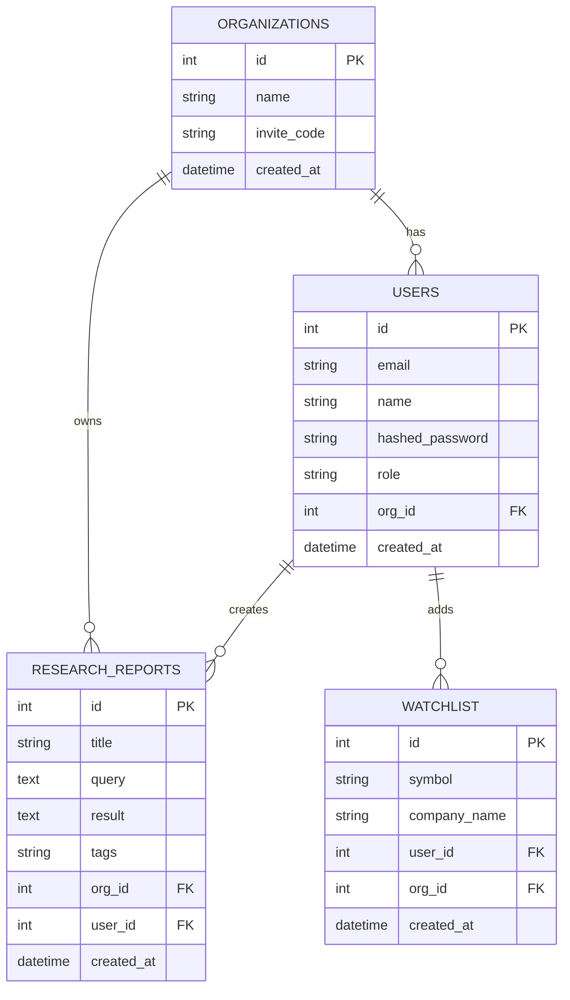
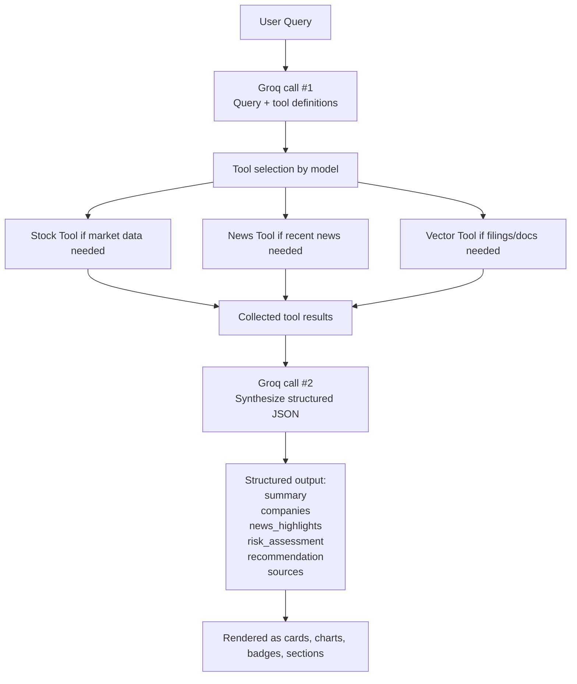
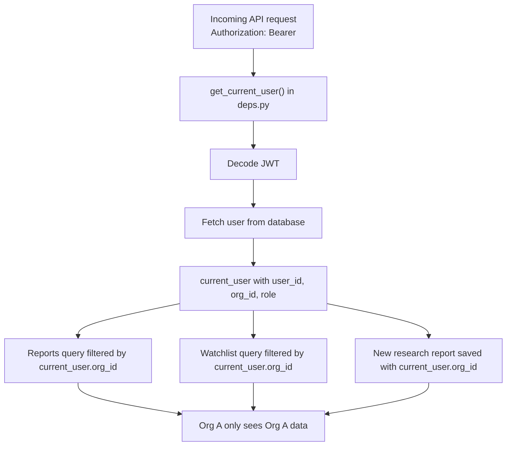

# Architecture Document — Klypup Research Dashboard

## 1. System Architecture Overview

```mermaid
flowchart TB
    subgraph Client["Client Layer"]
        FE["Next.js Frontend<br/>Port 3000"]
        UI["Pages:<br/>Login<br/>Dashboard<br/>Reports<br/>Watchlist<br/>Admin Panel"]
        APIClient["Axios API Client<br/>frontend/lib/api.ts"]
        FE --> UI
        FE --> APIClient
    end

    subgraph API["API Layer"]
        BE["FastAPI Backend<br/>Port 8000"]
        Auth["/api/auth<br/>signup, login"]
        Research["/api/research<br/>query, reports, stock-chart"]
        Watchlist["/api/watchlist<br/>add, remove, list"]
        Deps["Auth Middleware<br/>deps.py<br/>JWT verification + current user resolution"]
        BE --> Auth
        BE --> Research
        BE --> Watchlist
        BE --> Deps
    end

    subgraph Data["Data Layer"]
        SQL["SQLite<br/>users<br/>organizations<br/>research_reports<br/>watchlist"]
        Chroma["ChromaDB<br/>sample earnings reports<br/>SEC-style filings<br/>document chunks"]
    end

    subgraph AI["AI Layer"]
        Agent["AI Agent<br/>backend/app/services/agent.py"]
        Groq["Groq API<br/>Llama 3.3 70B"]
        Stock["Stock Tool<br/>yfinance"]
        News["News Tool<br/>NewsAPI"]
        Vector["Vector Tool<br/>ChromaDB search"]
        Agent --> Groq
        Agent --> Stock
        Agent --> News
        Agent --> Vector
    end

    FE -->|HTTP + JWT| BE
    Research --> Agent
    BE --> SQL
    Vector --> Chroma
    Stock -->|Yahoo Finance| YF["Yahoo Finance"]
    News -->|REST API| NewsAPI["NewsAPI"]

    ```mermaid
sequenceDiagram
    participant User
    participant FE as Next.js Frontend
    participant API as FastAPI Backend
    participant Auth as deps.py / JWT
    participant Agent as AI Agent
    participant Stock as Stock Tool
    participant News as News Tool
    participant Vector as Vector Tool
    participant DB as SQLite

    User->>FE: Enter research query
    FE->>API: POST /api/research/query + JWT
    API->>Auth: Resolve current user from token
    Auth-->>API: current_user
    API->>Agent: run_agent(query)

    Agent->>Agent: Send query + tool definitions to Groq
    Agent->>Stock: get_stock_data(symbol) if needed
    Agent->>News: get_news(company, symbol) if needed
    Agent->>Vector: search_documents(query) if needed
    Stock-->>Agent: market data
    News-->>Agent: news + sentiment
    Vector-->>Agent: relevant document chunks

    Agent->>Agent: Send tool results back to Groq
    Agent-->>API: structured JSON result

    API->>DB: Save ResearchReport with org_id and user_id
    API-->>FE: report_id, result, created_at
    FE->>FE: Render cards, metrics, chart, news, recommendation

```

What happens in practice
User types a natural-language query in the dashboard.
Frontend sends POST /api/research/query with the JWT token.
Backend resolves the authenticated user via deps.py.
research.py calls run_agent(query).
The agent asks Groq which tools are needed for the query.
The backend executes the selected tools.
Tool results are sent back to Groq for synthesis into structured JSON.
Backend stores the result in research_reports.
Frontend renders the response as structured UI components.



datetime
created_at
WATCHLIST
int
id
PK
string
symbol
string
company_name
int
user_id
FK
int
org_id
FK
datetime
created_at
Multi-tenant enforcement
users, research_reports, and watchlist are scoped through org_id.
Every protected route resolves the current user from the JWT.
Research reports and watchlist queries are filtered by current_user.org_id.
This prevents one organization from viewing another organization’s data.




Notes
Tool use is query-dependent, not a fixed hardcoded sequence.
If the user only asks for news, the system should prefer news-related tools.
If the user asks about filings or earnings details, document search is included.
The final output is structured JSON, not raw markdown.
Fallback behavior
If tool-calling or provider responses fail, the agent includes a fallback path that attempts manual tool selection based on the query and returns a degraded but usable result when possible.



Example
If current_user.org_id = 2, all report and watchlist queries are filtered to org 2.
Data belonging to org 3 is never returned by these routes.
